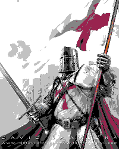
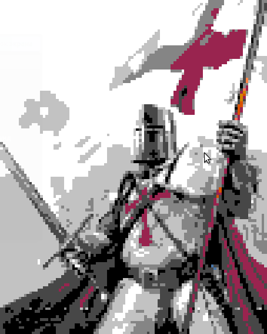
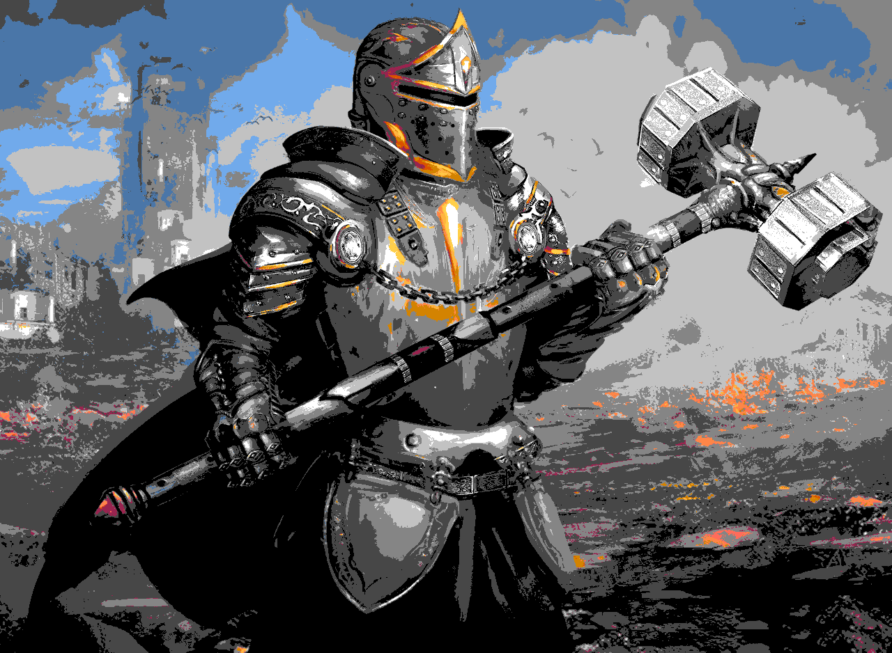
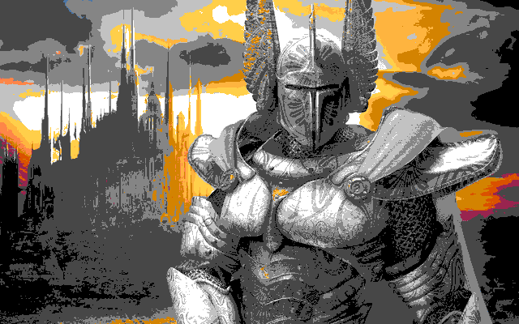

# Image pixel converter (Pixel battle converter)

[](https://travis-ci.org/joemccann/dillinger)

Pixel converter is a  mobile-ready, offline-ready, OpenCV powered Java Image converter which allow you to get any pixelized image.

  - Supports median filtration, erode and dilate methods
  - Use any colors you want
  - Support image resizing


# What it does

Here is an inline 

  


  

  


### Tech

Image Pixel Converter itself is open source with a [public repository][dill]
 on GitHub.

### Installation

Image Pixel Converter requires [OpenCV](https://opencv.org/) v4.x.x+ to run.

Install the dependencies and start the app

``` sh
$ java -jar pixelconvertor.jar attrs
```

### Attrs are

```sh
 -width = setup the output image width
 -height = setup the output image height
 Note: If there is no width or height or both output image will be the same size as input one
  -r = red color correction [-255;255]
  -g = green color correction [-255;255]
  -b = blue color [-255;255]
  -median k_size = setup the median filtration with k_size (k_size should be odd)
  -erode k_size = set erode with k_size arg.(k_size should be odd)
  -dilate k_size = set dilate with k_size arg. (k_size should be odd)
 -input = the input image path 
 -output = the output image path
 -colors args = replace default colorw with args values. It should be in hex form (For example "-colors #000000,#FFFFFF,#CDCDCD" #000000 or 000000 no matters)
```
### Running example
```sh
$ java -jar <how_you_call_artifacts_name>.jar -g 20 -dilate 1 -width 260 -height 300 -median 7 -input /home/mixa/crusader.bmp -output /home/mixa/initial_d/crusader.png
```
### Default palette

-  `#FFFFFF`
-  `#C2C2C2`
-  `#858585`
-  `#474747`
-  `#000000`
-  `#3AAFFF`
-  `#71AAEB`
-  `#4A76A8`
-  `#074BF3`
-  `#5E30EB`
-  `#FF6C5B`
-  `#FE2500`
-  `#FF218B`
-  `#99244F`
-  `#4D2C9C`
-  `#FFCF4A`
-  `#FEB43F`
-  `#FE8648`
-  `#FF5B36`
-  `#DA5100`
-  `#94E044`
-  `#5CBF0D`
-  `#C3D117`
-  `#FCC700`
-  `#D38301`


# Todos:
  - Import and pixelize images from Internet
  - Add more filter methods


License
----

MIT


**Free Software, Hell Yeah!**

[//]: # (These are reference links used in the body of this note and get stripped out when the markdown processor does its job. There is no need to format nicely because it shouldn't be seen. Thanks SO - http://stackoverflow.com/questions/4823468/store-comments-in-markdown-syntax)


   [dill]: <https://github.com/joemccann/dillinger>
   [git-repo-url]: <https://github.com/joemccann/dillinger.git>
   [john gruber]: <http://daringfireball.net>
   [df1]: <http://daringfireball.net/projects/markdown/>
   [markdown-it]: <https://github.com/markdown-it/markdown-it>
   [Ace Editor]: <http://ace.ajax.org>
   [node.js]: <http://nodejs.org>
   [Twitter Bootstrap]: <http://twitter.github.com/bootstrap/>
   [jQuery]: <http://jquery.com>
   [@tjholowaychuk]: <http://twitter.com/tjholowaychuk>
   [express]: <http://expressjs.com>
   [AngularJS]: <http://angularjs.org>
   [Gulp]: <http://gulpjs.com>

   [PlDb]: <https://github.com/joemccann/dillinger/tree/master/plugins/dropbox/README.md>
   [PlGh]: <https://github.com/joemccann/dillinger/tree/master/plugins/github/README.md>
   [PlGd]: <https://github.com/joemccann/dillinger/tree/master/plugins/googledrive/README.md>
   [PlOd]: <https://github.com/joemccann/dillinger/tree/master/plugins/onedrive/README.md>
   [PlMe]: <https://github.com/joemccann/dillinger/tree/master/plugins/medium/README.md>
   [PlGa]: <https://github.com/RahulHP/dillinger/blob/master/plugins/googleanalytics/README.md>
